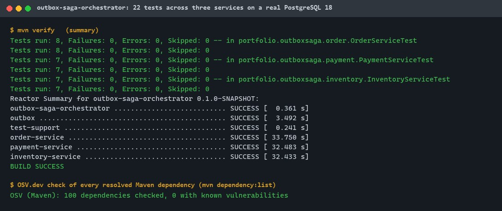
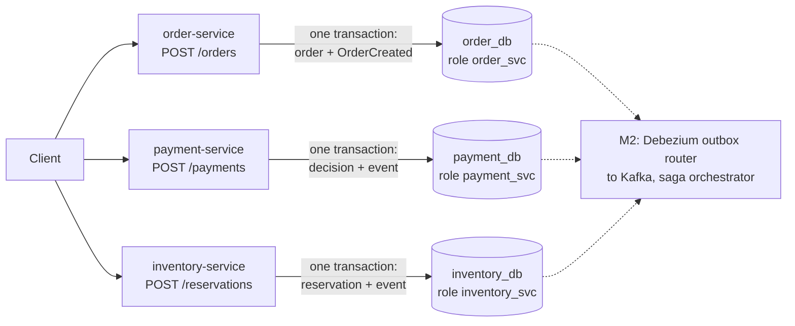
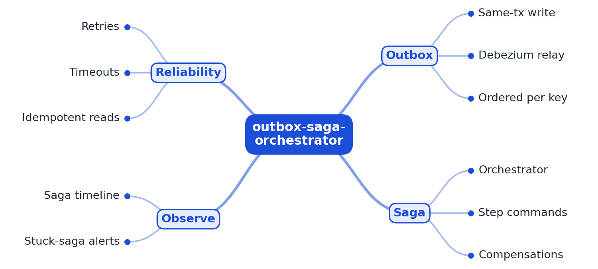
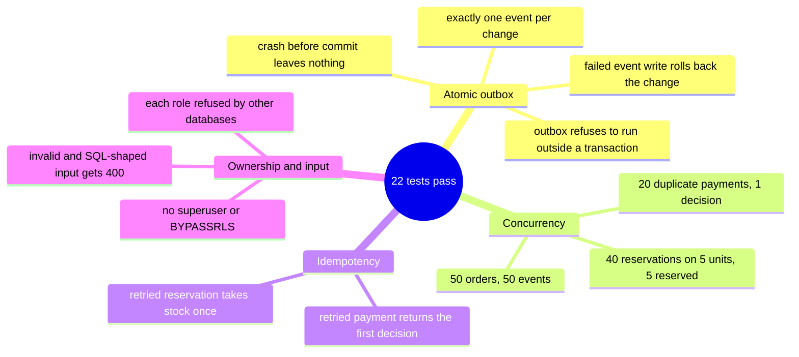

# outbox-saga-orchestrator

[](https://github.com/EquinoxWN/outbox-saga-orchestrator/actions/workflows/ci.yml)


> Keeps an order, its payment and its stock consistent across services, step one: each service owns its database, and a transactional outbox makes an event exist only if its change committed.

Part of my **Backend and API** list · Java (Spring Boot) · core project

## Proof it works

22 tests across the three services against a real PostgreSQL 18 started from embedded binaries: the outbox row commits with the business row or not at all, duplicate messages are applied once, stock is never oversold, and each service can only reach its own database. Every resolved Maven dependency was checked against OSV.dev, with none vulnerable after this check's upgrade:



## Architecture

**What M1 runs today:**



**Full roadmap (M1 to M3):**



## How it works

_Steps 1 and 2 are built and tested (M1); the rest is on the [roadmap](#roadmap)._

1. Order, payment and inventory services each own their database.
2. When a service changes state it writes the event to an outbox table in the same transaction, so the event exists only if the change committed.
3. Debezium's outbox router relays those rows to Kafka.
4. The orchestrator persists each order's state machine and sends commands step by step; if payment fails it runs compensations (release stock, cancel order).
5. Consumers de-duplicate by event ID, and Toxiproxy injects network faults to prove recovery.
6. A timeline UI shows every saga's steps, and stuck sagas raise alerts.

## Tech stack

| Area | In M1 | Planned |
|---|---|---|
| Core | Java 21, Spring Boot 4.1, PostgreSQL per service, Flyway | Saga orchestrator with compensations |
| Relay | Transactional outbox table | Kafka, Debezium outbox event router |
| Test / UI | Embedded PostgreSQL 18 | Testcontainers, Toxiproxy fault injection, saga timeline UI |

Language: **Java 21 (Spring Boot 4.1)**, one Maven module per service plus a shared outbox writer.

| Path | What it is |
|---|---|
| `outbox/` | `OutboxWriter` (joins the caller's transaction, refuses to run without one) and the outbox table migration |
| `order-service/` | Orders: `POST /orders`, `GET /orders/{id}` |
| `payment-service/` | Payments: authorize up to a limit, decline above it, idempotent per order |
| `inventory-service/` | Stock reservations that can never oversell, idempotent per order |
| `test-support/` | Real PostgreSQL from embedded binaries; `db/init.sql` creates one database and role per service |

## Run it

Needs JDK 21+ and Maven. No Docker: tests start a real PostgreSQL 18 from embedded binaries.

```bash
make setup   # build and install the modules
make lint    # compile every module
make test    # 22 tests: atomic outbox, idempotency, no overselling, database ownership
```

Run one service against your own PostgreSQL (after running [`test-support/src/main/resources/db/init.sql`](test-support/src/main/resources/db/init.sql) as a superuser):

```bash
cd order-service
SPRING_DATASOURCE_URL=jdbc:postgresql://localhost:5432/order_db \
SPRING_DATASOURCE_USERNAME=order_svc SPRING_DATASOURCE_PASSWORD=... mvn spring-boot:run
curl -X POST localhost:8081/orders -H 'Content-Type: application/json' \
  -d '{"customerId":"c-1","sku":"SKU-1","quantity":2,"amountCents":1999}'
```

## Tests and results

Latest local run on real PostgreSQL 18.6 (full detail in [docs/results/m1.md](docs/results/m1.md)):

| Check | Result |
|---|---|
| Crash after both writes, before commit | 0 rows and 0 events left, in all three services |
| Event write fails | the state change rolls back too |
| Outbox called outside a transaction | refused (`IllegalTransactionStateException`) |
| 50 concurrent orders | 50 orders, 50 distinct events |
| 20 concurrent duplicate payments for one order | 1 decision, 1 event |
| 40 concurrent reservations against 5 units | exactly 5 reserved, stock 0, never negative |
| Each service role connecting to another service's database | refused (SQLSTATE 42501) |
| Invalid or SQL-shaped input | 400, nothing stored |
| Tests passed | order 8, payment 7, inventory 7 |

### Test map



## Roadmap

**M1** (≈15 h)
- [x] Write `docs/rfc/0001-design.md`: problem, goals, non-goals, chosen design
- [x] Order, payment and inventory services each own their database.
- [x] When a service changes state it writes the event to an outbox table in the same transaction, so the event exists only if the change committed.

**M2** (≈20 h)
- [ ] Debezium's outbox router relays those rows to Kafka.
- [ ] The orchestrator persists each order's state machine and sends commands step by step; if payment fails it runs compensations (release stock, cancel order).

**M3** (≈25 h)
- [ ] Consumers de-duplicate by event ID, and Toxiproxy injects network faults to prove recovery.
- [ ] A timeline UI shows every saga's steps, and stuck sagas raise alerts.
- [ ] Publish the proof below with real numbers

## Proof

What this repo must show before it counts as done:

- A fault-injection matrix showing every failure mode ends in a consistent state.

| Result | Value |
|---|---|
| M3 proof above | Not measured yet (M3). Current M1 numbers: see [Tests and results](#tests-and-results). |

## Why it matters

- **Interview angle:** 'Keep data consistent across microservices'.
- **Upstream I'd like to contribute to:** Apache Seata (from Alibaba) or Debezium.

## Design docs

- [RFC 0001: design](docs/rfc/0001-design.md)
- [ADR 0001: record architecture decisions](docs/adr/0001-record-architecture-decisions.md)
- [ADR 0002: the outbox writer joins the caller's transaction](docs/adr/0002-outbox-joins-caller-transaction.md)
- [M1 results](docs/results/m1.md)

## Scope

This is a learning and portfolio system, not a hosted production service. Everything runs locally.

## Security and contributing

- Every GitHub Action is pinned to a commit SHA; workflows run read-only, without persisted credentials.
- Dependabot proposes dependency and action updates weekly.
- Every request body is validated; each service has its own database and least-privilege login role; queries are parameterised; Java dependencies are covered by Dependabot alerts and weekly update PRs.
- Report vulnerabilities privately: see [SECURITY.md](SECURITY.md). To contribute, see [CONTRIBUTING.md](CONTRIBUTING.md).

## License

MIT, see [LICENSE](LICENSE).
